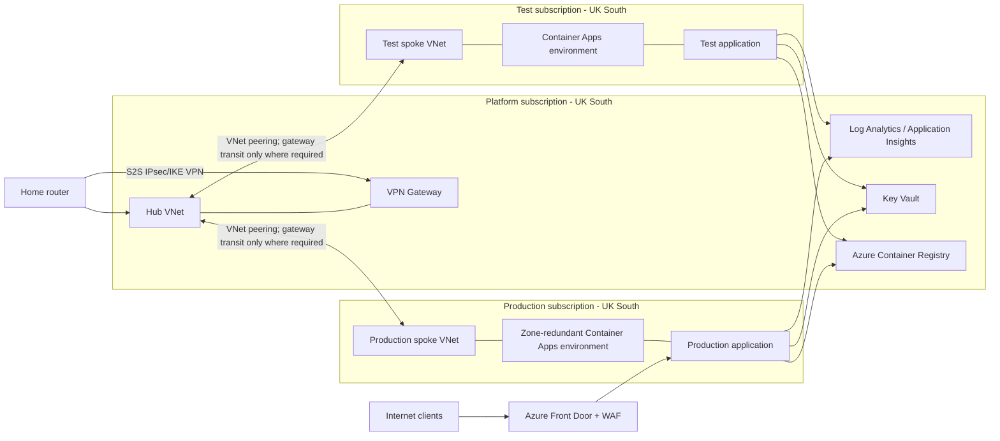

# Azure Landing Zone Recommendations for a Solo Online-Trading Application

> Research date: 2026-08-04

## Question and Decision

- **Research question:** What Azure landing-zone architecture and delivery approach is proportionate for an individual developer operating a containerised online-trading application, with Test and Production, home-office connectivity, UK South as the primary region, and UK West as a future resilience option?
- **Audience:** The individual developer who will build and operate the application and its infrastructure.
- **Decision this supports:** The initial platform shape, Azure services, environment isolation, security controls, and IaC delivery sequence.
- **Scope:** Landing-zone and workload-platform design only: subscriptions, network, ingress, container hosting, registry, observability, identity, IaC, and a staged UK West recovery option. It does not select a trading broker, define application architecture, establish financial-regulatory compliance, or provide legal advice.
- **Time boundary:** Microsoft Azure documentation available on 2026-08-04. Service availability, features, quotas, and prices must be rechecked immediately before deployment.

## Executive Summary

Use a small, opinionated landing zone rather than the full enterprise Azure Landing Zones accelerator. Create separate **Platform**, **Test**, and **Production** subscriptions; use a UK South hub virtual network for shared private connectivity; and use one spoke virtual network and one Azure Container Apps environment per workload subscription. This preserves a hard production boundary without creating subscriptions for every enterprise platform function.

For the initial release, host stateless services in zone-redundant Azure Container Apps environments, store images in Azure Container Registry (ACR), collect diagnostics centrally in Azure Monitor Logs, and expose only HTTP(S) through Azure Front Door with Web Application Firewall (WAF). Connect the home router to the hub with a route-based site-to-site IPsec/IKE VPN. The VPN is an administration and private-service path, not the public application ingress path.

Treat UK West as a defined but initially undeployed warm-standby design. A region pair does not create application failover. Multi-region recovery requires independently deployed applications, replicated state, container-image availability, tested Front Door failover, and explicit recovery objectives. Do not activate it until recovery point objective (RPO), recovery time objective (RTO), data-store choice, and the commercial cost of an outage have been decided.

## Findings

### Observed Facts

- Azure describes a landing zone as a governed multi-subscription environment consisting of a central platform landing zone and workload landing zones. It states that separate workload landing zones for environments such as test and production are common, while multiple subscriptions are needed only for workload, organisational, or quota boundaries. [What is an Azure landing zone?](https://learn.microsoft.com/en-us/azure/cloud-adoption-framework/ready/landing-zone/) (updated 2026-07-31).
- A site-to-site VPN is an IPsec/IKE tunnel between an on-premises VPN device and Azure. Azure documents it as suitable for development, test, lab, and small-to-medium production workloads; new VPN gateway SKUs include zone-redundant options. [About Azure VPN Gateway](https://learn.microsoft.com/en-us/azure/vpn-gateway/vpn-gateway-about-vpngateways) (updated 2026-07-01).
- Azure Container Apps is a managed, serverless container platform. A zone-redundant environment must be enabled at creation in a supported region and VNet; it cannot be enabled later. Microsoft recommends at least two minimum replicas for distribution across zones. Container Apps is single-region, so regional resilience requires a second environment, traffic failover, and replicated data. [Reliability in Azure Container Apps](https://learn.microsoft.com/en-us/azure/reliability/reliability-container-apps) (updated 2026-06-16).
- ACR geo-replication requires Premium. It provides active-active replicas and improves image data-plane availability, but replication is eventually consistent; a newly pushed tag might not be immediately available in another region. [Geo-replication in Azure Container Registry](https://learn.microsoft.com/en-us/azure/container-registry/container-registry-geo-replication) (updated 2026-06-16).
- UK South and UK West are an Azure region pair. Microsoft explicitly cautions that deployment in paired regions does not automatically provide high availability, disaster recovery, or failover. [Azure region pairs and nonpaired regions](https://learn.microsoft.com/en-us/azure/reliability/regions-paired) (updated 2026-06-26).
- Azure Front Door supports active-active and active-passive origin routing, health probes, WAF, rate limiting, managed TLS, and logging. Microsoft recommends WAF testing in detection mode before blocking, and describes Premium as the tier that supports Private Link to supported origins and managed WAF rules. [Architecture Best Practices for Azure Front Door](https://learn.microsoft.com/en-us/azure/well-architected/service-guides/azure-front-door) (updated 2025-10-30).
- Azure Policy can apply governance at management-group, subscription, resource-group, or resource scope. Microsoft recommends beginning with audit effects before enforcement, using initiatives, and managing policy changes as code with review. [Overview of Azure Policy](https://learn.microsoft.com/en-us/azure/governance/policy/overview) (updated 2026-07-08).
- Key Vault is intended for secrets, keys, and certificates. Microsoft recommends managed identities over service-principal secrets or certificates for applications accessing Key Vault. [What is Azure Key Vault?](https://learn.microsoft.com/en-us/azure/key-vault/general/basic-concepts) (updated 2026-06-12).
- Bicep is Azure's declarative IaC language. Microsoft recommends descriptive parameters, safe defaults, recent APIs, implicit dependencies, and marking sensitive outputs with `@secure()`. [Bicep best practices](https://learn.microsoft.com/en-us/azure/azure-resource-manager/bicep/best-practices) (updated 2026-07-14).

### Proposed Initial Architecture



### Inferences

- **Assumption:** The application is principally HTTP(S), its services can be made stateless, and sustained Kubernetes control-plane features are not an initial requirement. Under that assumption, Container Apps reduces the operational burden compared with AKS while retaining container deployment, revisions, scaling, and VNet integration.
- **Assumption:** A single developer needs strong production separation but does not need independent enterprise identity, security, management, and connectivity subscriptions. A Platform/Test/Production split is the smallest subscription model that creates a meaningful blast-radius and billing boundary.
- **Inference:** Azure Front Door Premium is the best default public gateway where internet-facing trading APIs or a UI need global edge protection, managed TLS, WAF, rate limiting, and a future multi-region failover path. For an API-only service with no present need for global entry or UK West failover, Application Gateway WAF v2 is a viable regional alternative, but it adds regional infrastructure and does not itself solve global failover.
- **Inference:** The home VPN improves private administrative access and private name resolution but cannot be the availability foundation for a public trading service because home power, ISP, router, and public-IP availability are outside Azure's control.
- **Inference:** Trading-related availability and integrity expectations justify a stronger operational baseline than a typical hobby service: immutable image digests, least privilege, auditable changes, bounded alerting, regular restore tests, and an explicit kill switch for live trading. The exact controls and retention period depend on the application's regulated status and data obligations, which this research cannot establish.

## Options and Trade-offs

| Option | Benefits | Costs or risks | Evidence and assumptions |
| --- | --- | --- | --- |
| One subscription, one VNet, shared Test and Production | Lowest initial cost and fewest resources. | Test changes and permissions can affect Production; weaker cost and policy boundaries; difficult to prove separation. | Rejected by inference: separate environment landing zones are common and subscriptions provide a practical boundary. |
| Three subscriptions: Platform, Test, Production | Production isolation, distinct access and budgets, shared resources remain central, still manageable alone. | Subscription vending, role assignments, and cross-subscription private DNS/diagnostics need deliberate IaC. | Recommended. Azure supports workload landing zones per environment and central platform capabilities. |
| Full enterprise-scale Azure Landing Zone accelerator | Comprehensive governance, management groups, policies, and scaling pattern. | Excess configuration and operating overhead for one developer and one workload. | Defer. The CAF says centralise only capabilities with clear governance, operational, or economic benefit. |
| AKS for container hosting | Maximum Kubernetes ecosystem and control. | Cluster upgrades, networking, security, node capacity, and operational ownership are disproportionate without Kubernetes-specific requirements. | Defer unless requirements demand Kubernetes APIs, operators, daemon sets, or specialised scheduling. |
| Azure Container Apps | Managed hosting, revision traffic controls, autoscaling, VNet support, and zone redundancy. | Container Apps is regional and local storage is ephemeral; applications must be designed as stateless. | Recommended, subject to the stated stateless-workload assumption. |
| Azure Front Door Premium + WAF | Edge WAF, rate limits, managed TLS, priority failover path, and optional Private Link to supported origins. | Ongoing cost; Front Door is a globally distributed dependency; WAF needs tuning. | Recommended for public HTTP(S) traffic. Validate the chosen Container Apps origin-security integration during the proof of concept. |
| Active-active UK South and UK West from day one | Best regional availability potential. | Doubles much of the platform cost and materially increases data consistency, testing, and operational complexity. | Defer. No RTO/RPO, data-store, or outage-cost target is supplied. |
| UK West warm standby after initial launch | Recovery route without duplicate steady-state application capacity; can scale after failover. | Longer RTO and dependency on pre-provisioned quotas, images, data recovery, DNS/Front Door configuration, and documented runbooks. | Recommended second phase after defining recovery targets and rehearsing failover. |

## Recommendation

### Configuration Baseline

1. Create management groups only as needed: `platform` and `landing-zones`, with the Platform subscription under the former and Test/Production under the latter. Do not recreate an enterprise hierarchy without a clear governance need.
2. Create three subscriptions: Platform, Test, and Production. Use separate resource groups for network, shared services, and each workload component. Apply resource locks only to critical Production resources after the deployment process is proven.
3. Build the UK South hub VNet with `GatewaySubnet`, a zone-redundant route-based Azure VPN Gateway SKU, and an IPsec/IKE site-to-site connection to the home router. Confirm that the home LAN CIDR does not overlap any Azure VNet range; use BGP only if the router and routing requirements justify it.
4. Build independent Test and Production spoke VNets. Peer each to the hub. Use gateway transit only for routes that actually need home-office reachability; do not force public application traffic or all outbound traffic through the home router.
5. Create a distinct, VNet-integrated Container Apps environment in each spoke. Enable zone redundancy during Production environment creation and configure at least two healthy Production replicas for critical request paths. Define readiness, liveness, and startup probes and resource limits. Keep state outside containers.
6. Create one ACR initially in UK South with private networking if the operating model can support the DNS and access complexity. Disable anonymous access, use managed identity with the least ACR role required, retain immutable digest references in deployment manifests, enable image vulnerability scanning, and define retention/cleanup rules. Add a UK West replica only when the secondary workload is being implemented; publish by digest and wait for replication before dependent regional deployment.
7. Use Azure Front Door Premium plus WAF as the only public HTTP(S) entry point for Production. Configure managed TLS, HTTPS redirect, an explicit health endpoint, rate limiting, and the applicable managed rules. Run WAF rules in detection mode and review false positives before blocking. Restrict origin access to Front Door using the most appropriate supported mechanism for the chosen Container Apps configuration; verify it in the proof of concept rather than assuming a particular Private Link path.
8. Use Key Vault with RBAC and managed identities for workload access. Store broker API credentials, signing keys, webhooks, and any third-party secret outside code, container images, pipeline variables, and Bicep outputs. Enable soft delete, purge protection, diagnostics, and rotation procedures.
9. Send control-plane, platform, WAF, VPN, ACR, Key Vault, and Container Apps diagnostics to a central Log Analytics workspace. Use Application Insights/OpenTelemetry for application telemetry. Create actionable alerts for failed deployments, Front Door/WAF anomalies, app error rate and latency, failed health probes, replica shortfall, VPN down, Key Vault access failures, ACR pull failures, and unusual trading activity. Set retention only after identifying audit and privacy obligations.
10. Assign minimal Azure Policy initiatives: allowed locations (`uksouth` initially, then `ukwest` when approved), required tags (`environment`, `owner`, `system`, `costCentre`, `dataClassification`), diagnostic settings, no public storage access, and security baselines appropriate to deployed services. Begin in `audit` mode, remediate findings, then selectively enforce. Apply privileged Azure RBAC through named groups, require MFA, and maintain two emergency access paths that are tested and documented.

### IaC and Delivery

Use **Bicep** as the default IaC tool because this is Azure-only and Bicep uses Azure Resource Manager directly. Choose Terraform instead only if the developer already has strong Terraform practice or must provision material non-Azure infrastructure; do not maintain both for the same resources.

Structure the repository as independently deployable layers, with no manual portal configuration except emergency break-glass procedures:

```text
infra/
  bootstrap/       # state/storage only if Terraform is selected; deployment identity prerequisites
  platform/        # management groups, policies, hub, VPN, logs, ACR, Key Vault, Front Door
  environments/
    test/          # Test subscription, spoke, Container Apps environment, diagnostics
    production/    # Production subscription, spoke, zone-redundant environment, diagnostics
  modules/         # small reusable Bicep modules
  parameters/      # non-secret per-environment .bicepparam files
```

Use federated workload identity from the CI system rather than long-lived Azure credentials. Protect the Production environment with required review/approval before `apply`. For every pull request, run Bicep build and linter, static security/policy checks, and an ARM what-if against the target scope. For merges, deploy Test automatically, run smoke tests through the gateway, then require explicit Production approval. Pin module versions and Azure API versions deliberately; output only non-sensitive IDs and endpoints.

### Delivery Sequence

1. **Foundation:** establish Entra access groups, subscriptions, budgets, naming/tagging, management groups, initial audit policies, a CI workload identity, and an emergency-access procedure.
2. **Network and observability:** deploy the Platform hub, VPN, private DNS design, central Log Analytics/Application Insights, diagnostic settings, alerts, and test the router tunnel and private resolution from the home office.
3. **Workload platform:** deploy Test then Production spokes, Container Apps environments, ACR integration, Key Vault/RBAC, and a minimal non-trading health service. Prove image pull, secret access, logs, alert delivery, and rollback.
4. **Public ingress:** deploy Front Door and WAF in detection mode. Validate TLS, health probes, origin restriction, rate limiting, common WAF false positives, and that the origin cannot be reached by unintended paths.
5. **Operational readiness:** introduce the application with a disabled-by-default live-trading capability, per-environment broker credentials, deployment approvals, rollback using immutable image digests, and runbooks for failed order submission, duplicated events, broker outage, credential compromise, and incident communication.
6. **Resilience phase:** write RPO/RTO targets; deploy matching UK West network and Container Apps infrastructure; add ACR replication; implement data replication and idempotency; configure Front Door priority failover; and conduct at least one recorded failover and restore exercise before claiming regional resilience.

## Open Questions and Limitations

- **Open questions:** Is the workload subject to FCA, market-abuse, best-execution, client-money, record-retention, GDPR, or broker-specific controls? Will it process personal data? Which database, queue, and broker APIs are needed? What RTO, RPO, maximum financial loss, trading-volume peak, availability target, and monthly budget are acceptable?
- **Unavailable evidence:** No application code, broker contract, data classification, network address plan, home-router model/capabilities, existing Entra tenant structure, CI provider, or cost model was supplied. This document cannot validate service quotas, UK-region availability for every SKU, or routing compatibility with the chosen router.
- **Conflicting sources:** No material conflict was identified among the cited Microsoft documentation. Some Azure documentation describes optional/pre-release capabilities; the recommendation deliberately avoids depending on preview features.
- **Validation limitations:** This is design research, not a deployed proof. The Front Door-to-Container-Apps origin-security mechanism, VPN interoperability, DNS/private endpoint configuration, WAF rule behaviour, performance, costs, and disaster-recovery RTO/RPO must be verified in a Test proof of concept. Legal and regulatory requirements require qualified advice.

## Sources

- [What is an Azure landing zone?](https://learn.microsoft.com/en-us/azure/cloud-adoption-framework/ready/landing-zone/) - Microsoft Learn, updated 2026-07-31.
- [About Azure VPN Gateway](https://learn.microsoft.com/en-us/azure/vpn-gateway/vpn-gateway-about-vpngateways) - Microsoft Learn, updated 2026-07-01.
- [Reliability in Azure Container Apps](https://learn.microsoft.com/en-us/azure/reliability/reliability-container-apps) - Microsoft Learn, updated 2026-06-16.
- [Geo-replication in Azure Container Registry](https://learn.microsoft.com/en-us/azure/container-registry/container-registry-geo-replication) - Microsoft Learn, updated 2026-06-16.
- [Azure region pairs and nonpaired regions](https://learn.microsoft.com/en-us/azure/reliability/regions-paired) - Microsoft Learn, updated 2026-06-26.
- [Architecture Best Practices for Azure Front Door](https://learn.microsoft.com/en-us/azure/well-architected/service-guides/azure-front-door) - Microsoft Learn, updated 2025-10-30.
- [Overview of Azure Policy](https://learn.microsoft.com/en-us/azure/governance/policy/overview) - Microsoft Learn, updated 2026-07-08.
- [What is Azure Key Vault?](https://learn.microsoft.com/en-us/azure/key-vault/general/basic-concepts) - Microsoft Learn, updated 2026-06-12.
- [Bicep best practices](https://learn.microsoft.com/en-us/azure/azure-resource-manager/bicep/best-practices) - Microsoft Learn, updated 2026-07-14.