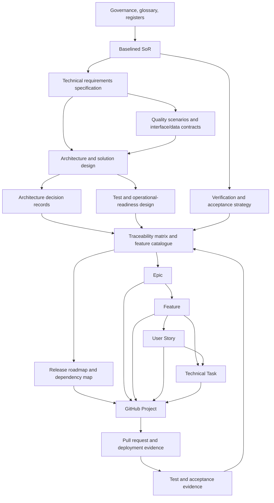

# From Statement of Requirements to a GitHub Project Implementation Plan

> Research date: 2026-08-05

## Question and Decision

- **Research question:** What repeatable, industry-aligned workflow should take an approved Statement of Requirements (SoR) through technical definition and implementation planning to a well-structured GitHub Project?
- **Audience:** Sponsors, product or service owners, business analysts, architects, security and operations owners, delivery teams, and project managers.
- **Decision this supports:** Which artefacts, controls, and GitHub planning conventions to adopt as a reusable delivery workflow for software projects.
- **Scope:** Internal or supplier-supported software, platform, service, and infrastructure projects. The workflow begins with a baselined SoR and ends with a delivery-ready GitHub Project; it includes backlog refinement and traceability but not detailed delivery execution, procurement law, or a project-specific technical design.
- **Time boundary:** Public sources and repository context were reviewed on 2026-08-05. GitHub product capabilities and organisational governance requirements can change.

## Executive Summary

Adopt a **traceability-first, iterative elaboration workflow**. Treat the approved SoR as the controlled statement of required outcomes and acceptance intent. Derive a technical requirement baseline and architecture decisions from it, then decompose those approved items into capability-oriented Features, value-oriented User Stories, and implementation-oriented Technical Tasks. Create GitHub Issues only once each item has an accountable owner, clear source links, measurable completion conditions, and understood dependencies.

The recommended hierarchy is:

```text
Business objective / approved SoR requirement
  -> Technical requirement(s) and verification intent
  -> Architecture decision(s), design specification, and risk treatment
  -> Epic (coherent delivery outcome)
  -> Feature (deployable capability within the Epic)
  -> User Story or Technical Task (independently planned work)
  -> GitHub Issue / sub-issue, pull request, test evidence, and acceptance record
```

The hierarchy is a planning convention, not a claim that GitHub enforces these names. GitHub Issues support issue types, sub-issues, dependencies, and integration with Projects; Projects provide linked issue data, custom fields, table, board, and roadmap views. [GitHub Docs, About issues, current page reviewed 2026-08-05](https://docs.github.com/en/issues/tracking-your-work-with-issues/about-issues) [GitHub Docs, About Projects, current page reviewed 2026-08-05](https://docs.github.com/en/issues/planning-and-tracking-with-projects/learning-about-projects/about-projects)

## Findings

### Observed Facts

- ISO/IEC/IEEE 29148 specifies requirements-engineering processes and the information items they produce, including content and format guidance. It applies across systems, software, products, and services. [ISO/IEC/IEEE 29148:2018, published 2018-11; confirmed 2024](https://www.iso.org/standard/72089.html)
- The Scrum Guide describes the Product Backlog as an emergent, ordered list of work needed to improve a product; refinement adds detail, such as description, order, and size. A Definition of Done is a formal description of an Increment when it meets required quality measures. [The 2020 Scrum Guide, published 2020-11](https://scrumguides.org/scrum-guide.html)
- User stories are concise, user-focused requests that retain an end-user perspective; acceptance criteria provide confirmation of completion. This is useful guidance, but not a formal standard. [Atlassian, User stories with examples and a template, page reviewed 2026-08-05](https://www.atlassian.com/agile/project-management/user-stories)
- GitHub Issues can be organised with issue types, labels, milestones, sub-issues, and blocking relationships. Issue and pull-request references support direct links between planned work and implementation. [GitHub Docs, About issues, current page reviewed 2026-08-05](https://docs.github.com/en/issues/tracking-your-work-with-issues/about-issues)
- GitHub Projects integrates issues and pull requests, supports custom fields, table/board/roadmap views, iteration planning, automation, status updates, and reusable organisation templates. [GitHub Docs, About Projects, current page reviewed 2026-08-05](https://docs.github.com/en/issues/planning-and-tracking-with-projects/learning-about-projects/about-projects)
- GitHub milestones group repository issues and pull requests, expose due date and completion information, and are best treated as a release or externally meaningful checkpoint rather than a replacement for workflow state. [GitHub Docs, About milestones, current page reviewed 2026-08-05](https://docs.github.com/en/issues/using-labels-and-milestones-to-track-work/about-milestones)

### Inferences

1. A stable SoR baseline and an emergent delivery backlog solve different problems and should be controlled separately. The former protects agreed outcomes and acceptance conditions; the latter permits iterative discovery and sequencing.
2. A requirement-to-work-item link alone is insufficient. The link should pass through technical requirements, design decisions, and verification intent, otherwise a team cannot explain why a solution was chosen or whether a requirement has been fully tested.
3. The simplest reusable GitHub model is one Issue per Epic, Feature, User Story, or Technical Task, with sub-issues for containment and native issue dependencies for blocking relationships. Do not simulate dependencies solely with labels or checklist text.
4. A Feature is useful as a planning convention between Epic and Story, but need not be a separate GitHub issue type if the organisation cannot configure it. A `work-type:feature` label or a Project single-select field can preserve the distinction.

## Recommended End-to-End Process

### Stage 0: Establish Delivery Controls

**Purpose:** Set the authority, information locations, naming rules, and change control before technical elaboration begins.

**Entry:** A named owner and a draft or approved SoR.

**Artefacts:**

| Artefact | Purpose and minimum information | Relationship and contribution to GitHub work |
| --- | --- | --- |
| Delivery governance and repository convention | Names the sponsor, product/service owner, technical owner, acceptance authority, reviewers, repositories, document locations, ID conventions, and change-approval path. | Governs all later artefacts. Defines labels, issue templates, and the rule that every issue cites its source ID(s). |
| Glossary and domain model, proportionate to complexity | Defines business terms, actors, key entities, and boundaries. | Prevents technical and backlog items from using different meanings for the same term. Link relevant glossary terms in Features and Stories. |
| Assumption, decision, risk, and issue registers | Separates unknowns, choices, threats/opportunities, and active problems; each record has an ID, owner, status, impact, and review trigger. | A decision or risk can create a discovery Spike, mitigation Technical Task, or blocking Issue. It must not silently become a requirement. |

**Exit:** Owners agree the document system of record, identifiers, review cadence, and change path.

### Stage 1: Baseline the SoR and Define Verification Intent

**Purpose:** Confirm the business outcome, scope boundary, quality constraints, and what evidence will support acceptance without deciding the solution prematurely.

**Entry:** Stage 0 controls exist.

**Artefacts:**

| Artefact | Purpose and minimum information | Relationship and contribution to GitHub work |
| --- | --- | --- |
| Baselined SoR and requirement register | Unique requirement ID; normative outcome; rationale/source; priority; owner; scope status; dependencies; constraints; verification method; objective pass criterion; required evidence; acceptance authority. | Governing source for all derived work. Each Epic/Feature/Story/Task links to one or more SoR IDs; each SoR ID must eventually link to verification and acceptance evidence. |
| Scope, context, and stakeholder map | In/out of scope; affected users, systems, teams, suppliers, environments, and external dependencies. | Seeds cross-team Epics, integration Features, and dependency Issues. |
| Initial verification and acceptance strategy | Candidate inspection, analysis, demonstration, test, and operational-evidence methods; environments; evidence owner; entry/exit criteria; acceptance process. | Identifies test automation, non-functional testing, documentation, training, and evidence-capture work before implementation tasks are estimated. |
| Change-control record | Baseline version, approval, effective date, and process for proposed changes and impact analysis. | A material SoR change triggers traceability review and updates or closes affected Issues; it is not made by editing an Issue description alone. |

**Exit:** The authorised owner approves the SoR baseline and accepts that each mandatory requirement has feasible verification intent.

### Stage 2: Elicit and Baseline Technical Requirements

**Purpose:** Translate required business outcomes into solution-neutral or technology-constrained technical obligations that engineers can design, estimate, and verify.

**Entry:** Approved SoR; known constraints and dependencies are available.

**Artefacts:**

| Artefact | Purpose and minimum information | Relationship and contribution to GitHub work |
| --- | --- | --- |
| Technical Requirements Specification (TRS) or system/software requirements specification | Unique technical requirement ID; parent SoR ID(s); behaviour, interface, data, security, performance, resilience, operational, accessibility, observability, migration, and support requirements; constraint; rationale; priority; verification method; acceptance criterion; owner. | Elaborates the SoR without redefining business intent. A technical requirement commonly maps to one Feature and one or more Stories or Technical Tasks. |
| Interface and data contract register | Producer/consumer; data classification; schema or API contract; ownership; lifecycle; failure behaviour; versioning; dependencies; validation method. | Creates integration Features, contract-test Stories, migration Tasks, and explicit cross-repository dependency links. |
| Non-functional requirement and quality-attribute scenarios | Stimulus, environment, response, measurable response measure, priority, and verification method for security, performance, reliability, recoverability, operability, and similar qualities. | Produces explicit architecture tests, capacity work, monitoring, hardening, resilience, and operational-readiness Tasks. |
| Compliance/control applicability assessment, where relevant | Applicable obligation/control; scope; evidence expectation; owner; exception route; review date. | Produces control-implementation and evidence-collection Issues. Specialist review is required for legal, regulatory, or security conclusions. |

**Exit:** Technical owners confirm that requirements are traceable to the SoR, internally consistent, testable, and free of unapproved solution choices.

### Stage 3: Select and Record the Technical Approach

**Purpose:** Make solution choices transparent, assess alternatives, and produce a coherent design that can be decomposed into delivery work.

**Entry:** Baselined technical requirements and priority risks.

**Artefacts:**

| Artefact | Purpose and minimum information | Relationship and contribution to GitHub work |
| --- | --- | --- |
| Architecture overview and solution design | Context/container/component views appropriate to complexity; responsibilities; boundaries; data flows; deployment topology; integrations; trust boundaries; operational model; mapping to TRS IDs. | Groups related technical requirements into coherent Epics and Features. Architectural components are not automatically tasks; create Issues only for changes required to deliver or validate them. |
| Architecture Decision Records (ADRs) | Decision ID; context; decision; considered options; consequences/trade-offs; status; decision owner; linked TRS and risk IDs. | Each accepted ADR links to the Feature/Task that implements its consequences. An undecided ADR becomes a time-boxed Spike or blocking decision Issue. |
| Threat, risk, and privacy assessment, as applicable | Assets/data; threats or risks; likelihood/impact; treatment; residual-risk decision; verification evidence. | Treatment actions become security Features/Tasks. Accepted residual risk is linked but is not falsely represented as completed implementation work. |
| Test strategy and high-level test design | Test levels, quality gates, test data/environment needs, automation approach, traceability, non-functional tests, and evidence retention. | Produces test-enablement Tasks and acceptance criteria for each Story; defines the evidence linked when an Issue closes. |
| Operational readiness design | Monitoring, alerting, logging, runbooks, backup/recovery, support model, service ownership, change and incident arrangements. | Produces Stories and Tasks for instrumentation, runbooks, training, recovery exercises, and handover. |

**Exit:** A designated technical authority accepts the design direction, or records unresolved choices as owned, time-boxed discovery work.

### Stage 4: Build the Traceability and Release Plan

**Purpose:** Show complete coverage from business need to acceptance, detect gaps early, and sequence delivery by dependencies and value.

**Entry:** Stages 1 to 3 have reviewed baselines or explicitly recorded discovery gaps.

**Artefacts:**

| Artefact | Purpose and minimum information | Relationship and contribution to GitHub work |
| --- | --- | --- |
| Traceability matrix | SoR ID; TRS ID; ADR/design link; risk/control link; Epic/Feature/Issue link; verification method; test/evidence link; acceptance status; change version. | The primary completeness check. A missing forward link identifies unplanned scope; a missing backward link identifies gold-plating or ungoverned work. |
| Capability map / Feature catalogue | Capability or Feature ID; user/business outcome; source SoR/TRS IDs; dependencies; delivery owner; proposed release; outcome measure. | Defines Feature-level GitHub Issues or Feature field values and the Epic to which each belongs. |
| Release roadmap and dependency map | Releases or increments; milestones; critical path; external dependencies; decision dates; capacity assumptions; sequencing rationale. | Sets GitHub Milestone and Project roadmap dates. Use native blocking relationships for issue-level dependencies. |
| Definition of Ready and Definition of Done | Ready criteria: source links, acceptance criteria, dependencies, estimate, owner, and test approach. Done criteria: implementation, review, tests, evidence, documentation, security/operations obligations, and acceptance state. | Gates when a GitHub Issue may enter an iteration and when it may be closed. The Done criteria must not replace a requirement-specific acceptance criterion. |

**Exit:** Every mandatory SoR requirement has a forward path to one or more planned Features/Issues and a planned verification route; each proposed Feature has a backward source link.

### Stage 5: Decompose into Epics, Features, Stories, and Technical Tasks

**Purpose:** Turn the verified design into a small, estimable, independently trackable delivery backlog while retaining outcome context.

**Entry:** Stage 4 traceability coverage is reviewed.

| Planning level | Definition and minimum content | Source and decomposition rule | GitHub representation |
| --- | --- | --- | --- |
| Epic | A sizeable, coherent delivery outcome spanning multiple Features or iterations. Include outcome, scope/non-scope, success measure, source IDs, dependencies, accountable owner, target release, and completion rule. | Derived from a cluster of SoR/TRS requirements and design elements that together deliver a meaningful outcome. | Parent Issue with type `Epic`, or an Epic Project field value. Contains Feature sub-issues or linked child Issues. |
| Feature | A deployable or demonstrable capability contributing to an Epic. Include user/business value, source IDs, high-level acceptance, dependencies, architecture/design references, and release intent. | Split Epics along independently valuable capabilities or architectural boundaries. Avoid Features that are merely component names. | Issue type `Feature` where supported; otherwise type/label/custom field. Parent is the Epic. |
| User Story | A small user or operator outcome, normally feasible in one iteration. Include persona/actor, need, value, acceptance criteria, source IDs, test approach, dependency links, and estimate. | Split Features by user journey, business rule, happy/error path, or independently testable outcome. | Issue type `Story`; child of Feature. A Story may have Technical Task sub-issues. |
| Technical Task | Implementation, research, migration, test-enablement, documentation, security, operational, or refactoring work that does not itself express user value. Include objective, scope, completion evidence, source/design link, dependency, and estimate. | Create only where needed to enable or complete a Story/Feature, or for a cross-cutting technical requirement. A time-boxed unknown is a Spike with an explicit decision/output. | Issue type `Task` or `Spike`; child of Story/Feature where practical. Link blockers natively. |

**Decomposition rules:**

1. Start from the Feature catalogue, not from a component inventory.
2. Write Stories as an outcome for a user, operator, or system actor. Use acceptance criteria to capture observable behaviour and non-functional constraints relevant to the Story.
3. Keep Technical Tasks separate from Stories when the work is engineering enablement, research, operations, test infrastructure, migration, or remediation rather than a user-visible outcome.
4. Split any item that cannot meet the team's iteration or flow-size policy. Do not split solely to manufacture velocity.
5. Give every child Issue a parent link and every blocker a native dependency link. A child link explains containment; a dependency explains sequencing. They are not interchangeable.
6. Preserve one or more source IDs in every item. Where one Issue satisfies many requirements, list each and retain a traceability-matrix row for each relationship.

**Exit:** The next release or planning horizon has ordered, ready work; later work remains at Epic/Feature level until it approaches delivery.

### Stage 6: Create and Configure the GitHub Project

**Purpose:** Create the delivery control surface where the backlog, implementation, dependencies, and reporting remain current with GitHub Issues and pull requests.

**Entry:** Stage 5 has produced a reviewed, prioritised backlog for the planning horizon.

**GitHub Project configuration:**

| Element | Recommended configuration | Why it matters |
| --- | --- | --- |
| Item source | Use repository Issues and pull requests as delivery records; use draft issues only for untriaged ideas or temporarily incomplete planning items. | Keeps implementation and planning connected. Convert or replace drafts before commitment. |
| Issue types | Configure or conventionally use `Epic`, `Feature`, `Story`, `Task`, `Spike`, `Bug`, and `Risk/Decision` where governance requires them. | Makes aggregation and views consistent without forcing all work into user-story language. |
| Required Issue template fields | Title; outcome/objective; source IDs; parent; scope/non-scope; acceptance criteria or completion evidence; dependencies; test/evidence approach; estimate; owner; links to design/ADRs. | Applies Definition of Ready consistently and preserves traceability in the durable work record. |
| Project fields | `Status`, `Work type`, `Priority`, `Size`, `Iteration`, `Target date`, `Target release`, `Area/component`, `Risk`, `Requirement IDs`, `Design/ADR link`, and `Acceptance state`. Add only fields needed for decisions and reporting. | GitHub Projects supports custom fields and multiple views; these fields allow planning without duplicating Issue body content. |
| Labels | Use stable, orthogonal labels such as `area:*`, `kind:*`, `risk:*`, `blocked`, and `needs-decision`. Do not encode workflow status in labels. | Status belongs in the Project field; labels support cross-project search and automation. |
| Milestones | Use for a release, contractual checkpoint, or externally visible delivery target. | Milestones group Issues and pull requests and display progress; they are not a substitute for a Project roadmap or iteration field. |
| Views | `Backlog` table grouped by work type; `Delivery` board grouped by status; `Roadmap` grouped by Epic/Feature and ordered by target date; `Iteration` filtered to current iteration; `Risks and decisions` filtered to open blockers. | Different planning and delivery questions need distinct views over the same source data. |
| Automations | Auto-add matching repository issues, set initial status for new items, and archive completed items only after evidence/acceptance rules permit. | Reduces administrative drift. Review automation effects before applying them to a controlled baseline. |

**Issue lifecycle:** `Draft` -> `Refinement` -> `Ready` -> `In progress` -> `In review` -> `Verified` -> `Done`, with `Blocked` represented by a dependency plus a visible status or field state. Tailor names to the team, but define the entry/exit criteria. Closing an Issue should mean its Definition of Done and linked evidence requirements are met, not merely that code exists.

**Exit:** The Project contains the planned Issues with parent/dependency links, fields, prioritisation, release/iteration assignment, and views. The traceability matrix links each committed Issue to its GitHub URL/number.

### Stage 7: Maintain Traceability Through Delivery and Acceptance

**Purpose:** Keep plans honest as learning occurs, prove completion, and prevent closed work from drifting away from requirements.

**Entry:** A configured GitHub Project and active delivery Issues.

**Artefacts and operating cadence:**

| Activity / artefact | Purpose and minimum information | GitHub relationship |
| --- | --- | --- |
| Backlog refinement record | Decisions on scope, split/merge, estimates, acceptance criteria, dependencies, and ready status. | Updates Issue content and Project fields; material requirement changes return to change control. |
| Pull request and implementation evidence | Code/configuration link; review; automated checks; deployment/release record; linked Issue. | Reference the Issue in the pull request so GitHub records the relationship; use closing keywords only when the Issue is genuinely complete. |
| Test and verification evidence | Test ID/result; environment; evidence location; requirement/Issue links; defect or exception reference. | Links to Story/Task and updates the traceability matrix and acceptance state. |
| Acceptance record | Requirement/Feature scope accepted, conditionally accepted, rejected, or excepted; authority; date; evidence links; follow-up action. | Enables Project reporting by acceptance state and prevents delivery status from being mistaken for business acceptance. |
| Change request and impact assessment | Proposed baseline change; rationale; affected SoR/TRS/design/Issues/tests; decision; version. | Updates linked Issues only after approval; obsolete work is closed with rationale rather than silently deleted. |

**Exit:** Each released capability has evidence back to its source requirement and an explicit acceptance or exception state. The Project remains a current delivery plan, not an archive detached from implementation.

## Document Hierarchy and Dependencies



The authoritative dependency is the traceability relationship, not the diagram's document order. For example, a technical discovery Spike can inform a TRS or ADR, but its result must be reviewed through the relevant baseline/change-control path before it changes delivery scope.

## Minimum Reusable Templates

Use these as mandatory headings or fields, scaled to project risk rather than as fixed-length documents.

| Template | Required headings or fields |
| --- | --- |
| SoR requirement | ID; requirement; type; rationale/source; priority; owner; dependencies; verification method; objective pass criterion; required evidence; acceptance authority; baseline/version. |
| Technical requirement | ID; parent SoR ID; statement; category; constraints; rationale; priority; interface/data impacts; verification method; criterion; owner; status. |
| ADR | ID; title; status; context; decision; options; consequences; linked requirements/risks; owner; decision date. |
| Traceability row | SoR ID; TRS ID; design/ADR; Epic/Feature; Issue URLs; verification/test; evidence; acceptance state; baseline version. |
| Epic Issue | Outcome; source IDs; scope/non-scope; success measure; dependencies; target release; child Features; completion rule. |
| Feature Issue | Capability/value; parent Epic; source IDs; design links; high-level acceptance; dependencies; release intent; child Stories/Tasks. |
| Story Issue | `As a <actor>, I want <outcome>, so that <value>`; source IDs; acceptance criteria; dependencies; test approach; estimate; Definition of Done. |
| Technical Task Issue | Objective; parent; source/design/risk link; scope; completion evidence; dependencies; estimate; owner. |
| Spike Issue | Question; decision needed; time box; research method; expected output; linked blocker; decision owner. |

## Options and Trade-offs

| Option | Benefits | Costs or risks | Evidence and assumptions |
| --- | --- | --- | --- |
| Documents only, then manually create Issues | Simple for a small project and preserves a formal baseline. | Traceability decays; delivery status must be reconciled manually; weak visibility of blockers. | GitHub supports integrated Issues and Projects, so manual duplication gives up available links. |
| GitHub Issues as the only requirements store | Low tool overhead and immediate visibility. | Narrative requirements, approvals, decisions, and acceptance baselines become hard to govern; iterative editing can blur approved scope. | Appropriate only for low-risk, small work with explicit repository governance. |
| Recommended: controlled documents plus linked GitHub Issues/Project | Separates baselines from emergent work while retaining bidirectional traceability and integrated delivery reporting. | Requires ID conventions, review discipline, and periodic traceability maintenance. | Aligns requirements engineering, iterative-backlog refinement, and GitHub's issue/project capabilities. |
| Dedicated requirements-management suite plus GitHub integration | Stronger formal traceability and reporting for regulated or safety-critical work. | Cost, administration, integration complexity, and duplicate work-item governance. | Consider when contract, regulatory, safety, scale, or audit needs exceed a versioned register and GitHub Project. |

## Recommendation

Adopt the seven-stage workflow above with a **controlled SoR and technical requirement baseline, lightweight architecture decision records, a living traceability matrix, and GitHub Issues as the delivery record**. Create an organisation-level GitHub Project template containing the recommended fields, views, issue forms, labels, and workflow rules, but leave project-specific values empty.

Keep formal hierarchy proportionate. Small, low-risk projects can combine the TRS, design, and traceability matrix in one controlled Markdown document, while retaining distinct sections and identifiers. Larger, multi-team, regulated, or safety/security-sensitive projects should keep the registers separate, require formal review gates, and consider a specialist requirements tool. The recommendation would change where an organisation already has a mandated lifecycle, regulated traceability tooling, or a contract that specifies artefacts and approvals.

## Open Questions and Limitations

- **Open questions:** Which GitHub plan and organisation settings are available, including organisation issue types and Project templates? What delivery cadence, repository topology, compliance obligations, audit needs, and approval authorities apply? Which artefacts must be formally baselined under the organisation's change-control process?
- **Unavailable evidence:** No organisation-specific GitHub configuration, delivery policy, repository structure, product type, contract, regulatory regime, team capacity model, or existing issue template was supplied. This research does not validate a particular configuration.
- **Conflicting sources:** No direct conflict was found. ISO/IEC/IEEE describes requirements engineering, Scrum describes an emergent Product Backlog, Atlassian provides practitioner terminology for epics and stories, and GitHub describes product capabilities. They do not prescribe one universal artefact hierarchy. This recommendation deliberately treats `Feature` and work-item names as conventions rather than universal standards.
- **Validation limitations:** Public documentation was reviewed rather than full paid standards or an operational GitHub organisation. GitHub capabilities, limits, and availability vary by plan and settings; verify them in the target organisation before standardising the template. Legal, regulatory, procurement, privacy, security, and accessibility requirements require qualified organisational review.

## Sources

- International Organization for Standardization, [ISO/IEC/IEEE 29148:2018 - Systems and software engineering: Requirements engineering](https://www.iso.org/standard/72089.html), published 2018-11, confirmed 2024.
- Ken Schwaber and Jeff Sutherland, [The 2020 Scrum Guide](https://scrumguides.org/scrum-guide.html), published 2020-11.
- GitHub Docs, [About issues](https://docs.github.com/en/issues/tracking-your-work-with-issues/about-issues), current page reviewed 2026-08-05.
- GitHub Docs, [About Projects](https://docs.github.com/en/issues/planning-and-tracking-with-projects/learning-about-projects/about-projects), current page reviewed 2026-08-05.
- GitHub Docs, [About milestones](https://docs.github.com/en/issues/using-labels-and-milestones-to-track-work/about-milestones), current page reviewed 2026-08-05.
- Atlassian, [User stories with examples and a template](https://www.atlassian.com/agile/project-management/user-stories), page reviewed 2026-08-05.
- Atlassian, [Epics, stories, and initiatives](https://www.atlassian.com/agile/project-management/epics-stories-themes), page reviewed 2026-08-05.
- Repository context: [Statement of Requirements: Purpose, Content, and Use](./statement-of-requirements-purpose-and-use.md), research date 2026-08-03.